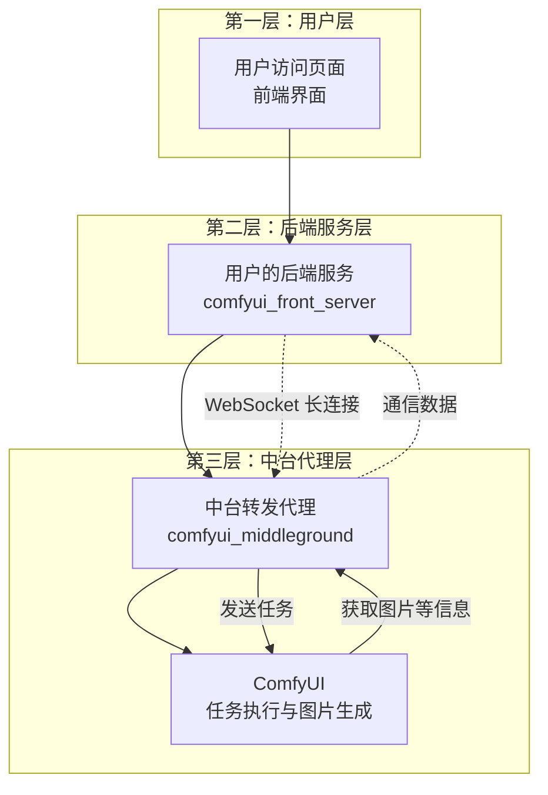

# comfyui_server
comfui家庭服务转代理

##核心架构图

```mermaid
graph TD
    A[用户访问页面<br/>前端界面] --> B[用户的后端服务<br/>comfyui_front_server]
    B --> C[中台转发代理<br/>comfyui_middleground]
    C --> D[ComfyUI<br/>任务执行与图片生成]
    
    B -.->|WebSocket 长连接| C
    C -.->|通信数据| B
    
    C -->|发送任务| D
    D -->|获取图片等信息| C
    
    subgraph "第一层：用户层"
        A
    end
    
    subgraph "第二层：后端服务层"
        B
    end
    
    subgraph "第三层：中台代理层"
        C
        D
    end
```

## 前端用户页面

## 后台管理页面

